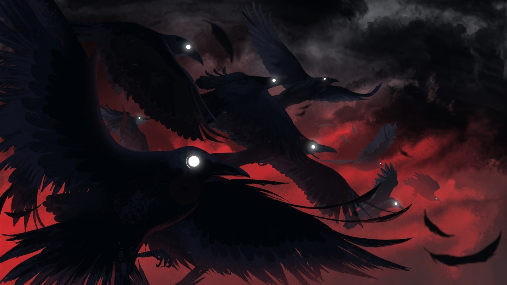

# wallpaper-gifs
A simple wallpaper gallery for Linux.

Open `index.html` in your browser or publish this repository with GitHub Pages to browse the image collection.

## Preview

## How to use
1. Open `index.html` in a browser.
2. Click "View" to preview a wallpaper.
3. Click "Download" to save the wallpaper locally.

## Files
- `index.html`: gallery page
- `styles.css`: gallery styles
- `script.js`: loads wallpaper thumbnails and download links
- `wallpapers/`: image files